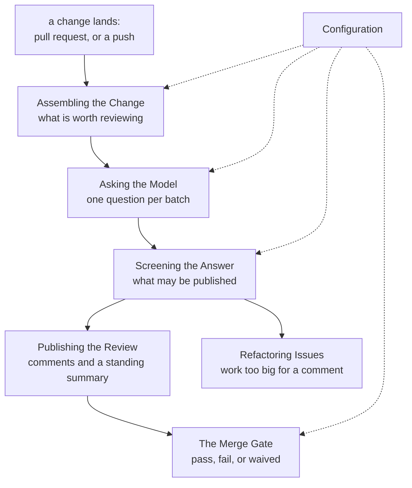
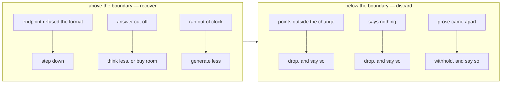

## Abstract

Hawky is an automated code reviewer that lives inside a repository's own automation. When a change arrives it works out what was changed, asks a language model to read it, decides how much of the answer is fit to publish, leaves the surviving parts as review comments and a standing summary, and optionally lets the result block a merge. This root paper maps the system into seven capabilities, each explored in its own paper.

## Introduction

Reviewing a change is a reading task, and language models are good at reading. Wiring one into a repository is where the difficulty actually lies. The reviewer is shown fragments rather than a whole codebase, so it will sometimes talk about code it was never given. It answers in prose, so it can wander, repeat itself, or hand back its own deliberation instead of a conclusion. It is billed per attempt, so the same question asked five times is a real cost. And the moment its opinion is allowed to block a merge, every mistake it makes becomes somebody's blocked afternoon.

The mental model to carry through the rest of these papers is a **pipeline with a trust boundary across the middle**. Everything before the boundary is about asking a good question of a model that may be running anywhere, on any endpoint, with any appetite for thinking. Everything after it assumes the answer may be wrong, and is built to publish only the parts that can be checked against something the system already knows.

## Related Work

The capabilities below decompose the system. Read them in pipeline order, or jump to the one your question is about:

- [Assembling the Change](./assembling-the-change/README.md) — deciding what to review and rendering it so a reviewer can point at exact lines.
- [Asking the Model](./asking-the-model/README.md) — the brief, the response contract, and surviving whichever endpoint is on the other end.
- [The Reuse Check](./the-reuse-check/README.md) — looking up what the repository already defines, so "this already exists" is evidence rather than a guess.
- [Screening the Answer](./screening-the-answer/README.md) — the trust boundary: which findings and which prose are fit to publish.
- [Publishing the Review](./publishing-the-review/README.md) — inline comments, the standing summary, and what happens when the host refuses them.
- [The Merge Gate](./the-merge-gate/README.md) — turning a review into a pass or a fail, and the reviewer's route past a wrong one.
- [Refactoring Issues](./refactoring-issues/README.md) — structural work filed as tracked issues instead of comments.
- [Configuration](./configuration/README.md) — the two places settings come from, and what a typo in one of them does.

## Description

**The shape of a run.** A single run is one pass down the pipeline, with the model called once per batch of files and nothing else calling out to it.

```
 event  ─►  what changed?  ─►  is it worth tokens?  ─►  render with line numbers
                                                              │
                                                              ▼
                                            pack into batches, one question each
                                                              │
                                     ┌────────────────────────┴──────────────────┐
                                     ▼                                           ▼
                            ask the model                              look up prior definitions
                                     └────────────────────────┬──────────────────┘
                                                              ▼
                                                    ═══ trust boundary ═══
                                                              │
                        ┌─────────────────────────────────────┼───────────────────────┐
                        ▼                                     ▼                       ▼
                 inline comments                      standing summary          tracked issues
                        └─────────────────┬───────────────────┘
                                          ▼
                                    pass / fail / waived
```

**The trust boundary is the organising idea.** Above it, the system is generous: it will step down through response formats an endpoint does not support, turn the model's thinking down, buy it more room, and retry a request the server was too busy to answer. Below it, the system is suspicious: a finding that points at a line the change does not contain is discarded, a finding whose text cannot describe any change is discarded, prose that arrives shaped like a transcript is withheld whole, and anything thrown away is named in the run log and counted where a reader can see the count.



**Two things separate this from a wrapper around a model call.** The first is that the reviewer is given evidence rather than asked to recall: the question "is this already in the repository?" is answered by searching the checked-out tree before the call, not by asking a model that cannot see it. The second is that the system publishes in two voices — the parts it computed itself (the verdict, the counts, the waivers) speak as the tool, and the model's own prose is quoted under an attribution, because those two carry different warranties.

**What a reader can control** splits along the same line: which changes get looked at, how hard the model is asked to think, how high the bar for publishing is, and whether any of it is allowed to stop a merge.

## Conclusion

Hawky is a pipeline with a trust boundary: assemble a reviewable change, ask one well-formed question per batch, then treat the answer as a claim to be checked rather than a result to be printed. The natural first stop is [Assembling the Change](./assembling-the-change/README.md), which establishes the line-numbered view everything downstream anchors to; [Screening the Answer](./screening-the-answer/README.md) is where the system's character is clearest.
