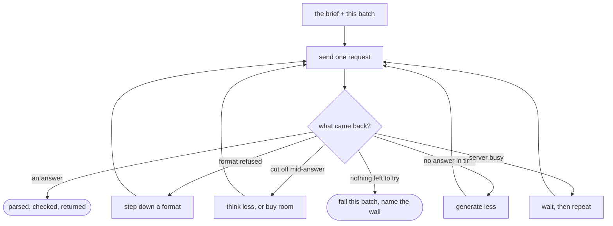
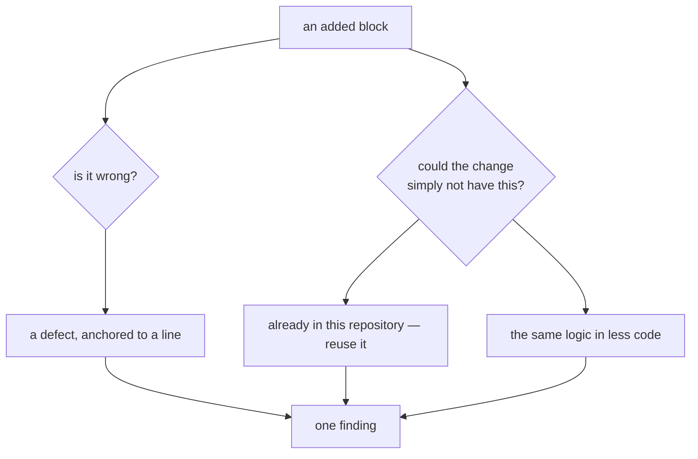
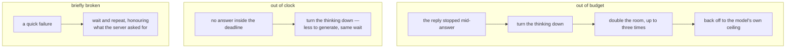

## Abstract

One batch of changed files becomes exactly one question, and this paper is about that question and everything that can go wrong asking it. Two halves: the **brief** — what the reviewer is asked to look for, what it is told not to waste output on, and the shape its answer must take — and the **negotiation** — how a request survives an endpoint whose capabilities, output ceiling, appetite for thinking, and patience are all unknown in advance.

## Introduction

The brief is more than a description of the job. Everything downstream discards some of what comes back — findings below a severity floor, findings below a confidence floor, everything past a cap on how many comments one run may leave — and a reviewer that does not know those limits spends its most expensive resource writing things nobody will read. So the limits are stated in the brief, not just enforced afterwards.

The negotiation exists because the other end is unknown. The system talks to a first-party API and to anything speaking a widely-copied chat protocol, which in practice means a long tail of gateways and self-hosted servers implementing different subsets of it. Rather than asking an operator to declare what their endpoint supports, the system asks for the strictest thing first and steps down when refused.

Three walls in particular are worth holding in mind, because most of the machinery here exists for them: an endpoint may refuse the response format, the reply may be cut off before it finishes, and the request may run out of clock. They look similar from a log and have opposite remedies.

## Related Work

- Parent: [Hawky](../README.md).
- The batch being asked about was prepared by [Assembling the Change](../assembling-the-change/README.md), along with the list of what was left out.
- The evidence that makes the reuse question answerable is retrieved by [The Reuse Check](../the-reuse-check/README.md).
- Whatever comes back is treated as a claim, not a result, by [Screening the Answer](../screening-the-answer/README.md).
- The thinking level, output ceiling, deadline, and the endpoint-specific passthrough are all set in [Configuration](../configuration/README.md).

## Description

**The brief.** The reviewer is told it is reading only the changed fragments of a larger codebase, and then asked for two different things about the added lines: whether they are wrong, and whether they need to exist at all.



The second question is part of every review rather than a mode to switch on, and it comes with guard rails, because "write less code" is advice that can do damage. Validation at a trust boundary, error handling that prevents data loss, a security measure, an accessibility basic, and the one check that fails when the logic breaks are all explicitly out of scope however many lines they cost — and so is anything the change's own description asked for by name. Complexity findings are also told to stay at or below the middle of the severity scale, because they are maintenance cost rather than breakage and must not stop a merge.

Several rules exist to keep the reviewer's output honest rather than merely relevant. It must anchor to a line the change actually added, and never invent a number. It must assume that anything it cannot see exists and is correct, because it is reading fragments with gaps between them. It must report a defect only if it can name the input or state that triggers it. And every field must hold a finished answer rather than working-out — the one route by which deliberation reaches a published comment is the model writing it into a finding itself, which no amount of stripping downstream can reach.

Style opinions are excluded outright: formatting, naming, and comment density are what linters already handle, and the author does not want them from a reviewer.

**One brief, many batches.** The instruction block is deliberately identical across every batch in a run, so a provider that supports it can charge for the shared preamble once and read it at cache rates thereafter. Anything that varies per batch lives in the question instead.

**The response contract.** The answer must be a single structured object with three parts: a short description of the change, a list of findings anchored to lines, and a list of structural work too large to be a comment. Each finding carries a severity, a confidence, a category, a one-line title, a body, and optionally a replacement for the lines it points at. The contract is written to satisfy the stricter of the two protocols the system speaks, so one shape works for both.

**Negotiating the format.** The request starts at the strictest setting and steps down one rung at a time, remembering where it landed for the rest of the run:

```
  a schema the server enforces
        │  refused, or accepted and then ignored
        ▼
  "answer in JSON" mode, schema written into the question
        │  refused, or still wrong
        ▼
  a plain instruction to answer with one object and nothing else
```

Enforcement quality varies as much as support does, so the answer is checked against the contract on this side rather than assumed to have been enforced. An endpoint that accepts a schema and then ignores it steps down exactly as if it had refused, and the log names the offending field.

**The three walls.** These are the failures that dominate real runs, and the system reads them apart by what they cost rather than by what they are called.



A thinking model produces its deliberation and its answer from the same output allowance, which makes the first wall common and its obvious remedy wrong: asking about less code does not help, because the thinking scales with the question rather than with the answer. So the ladder turns the thinking down first, then buys more room — which costs nothing on batches that already fit, since generation is billed and the ceiling is not — and a raise earned by one batch carries to the rest of the run. When the accounting shows that almost the whole allowance went to deliberation and there is no rung left to turn down, the ladder stops rather than spending two more doubled calls on the same wall.

The descent has a floor. It will not turn the thinking off entirely on its own, because reading a change for defects is the work the thinking does: a reviewer told not to think comes back in seconds having found nothing, and a merge gate cannot tell that from a clean change. Arriving there is a decision a maintainer makes explicitly and is warned about; it is not something a retry does quietly on a change nobody was watching.

**Clock and budget are not the same wall**, and conflating them is how a run once spent fifty minutes to report nothing. The deadline is derived from the output allowance rather than fixed, so raising the allowance also buys time to deliver it; a request that runs out of clock is never repeated unchanged; and a server error arriving most of the way through its own deadline is read as a deadline rather than a blip, because a fixed limit on the path will be crossed again by the identical request. Each of the three has advice attached that names which knob actually moves it.

**Taking the deliberation out.** Thinking models leak their chain of thought into the answer, either in a dedicated field or wrapped in tags inline. It is removed before parsing — and an unclosed opening tag drops everything after it, since there is no answer hiding behind it and leaving it in gives the parser stray punctuation to latch onto. Stripping runs only as a repair, after the raw body fails to parse, so a review that legitimately quotes one of those tags in its own text survives untouched. Extraction is similarly defensive: a body may arrive fenced, or trailed by a sentence of commentary, so the parser looks for balanced objects rather than slicing between the first and last brace.

## Conclusion

Asking the model is one question per batch, written so the reviewer knows the bar it is being held to, and sent through a negotiation that assumes nothing about the endpoint. The recurring lesson in the recovery ladders is that failures which look alike in a log — refused, cut off, timed out, busy — have opposite remedies, and that guessing wrong costs a run rather than a call. What comes back is not yet a review: continue to [Screening the Answer](../screening-the-answer/README.md).
