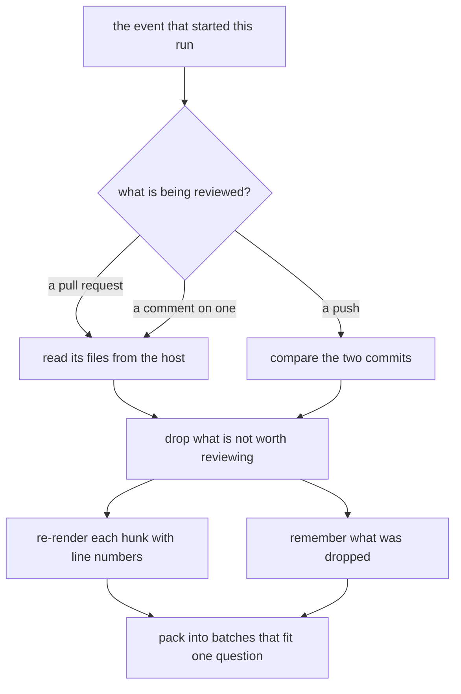
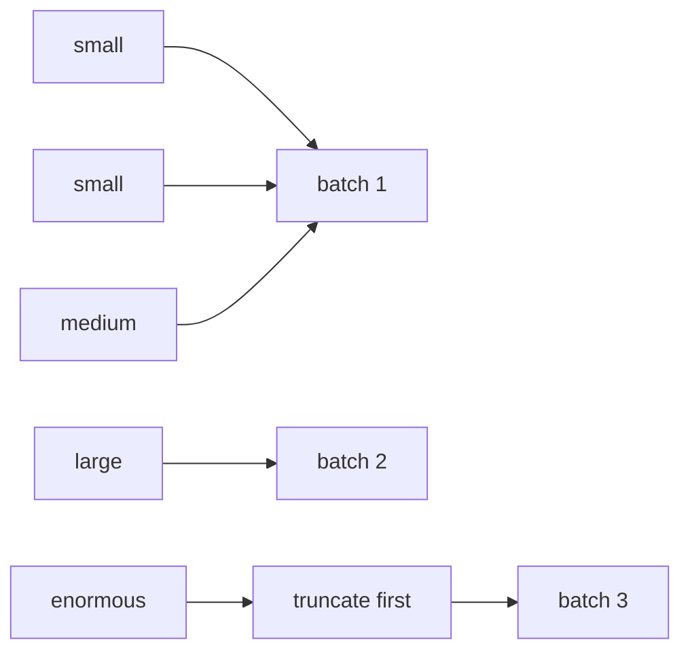

## Abstract

Before anything can be reviewed, the system has to answer two questions: what changed, and which of it is worth spending a model's attention on. This paper covers how a run works out its subject from whatever event started it, how the changed files are filtered down, how each fragment is re-rendered so the reviewer can point at an exact line, and how the result is packed into batches small enough to ask about in one go. It also covers the thing most of this work exists to protect: the record of what was left out.

## Introduction

The automation that triggers a run does not necessarily say what to review. A run may be attached to a proposed change, or to a comment left on one, or to a commit pushed to the main line with no proposal attached at all, or to a deliberately indirect trigger used when the change came from an untrusted fork. Each of those has to resolve to the same thing: an owner, a repository, a head revision, and — when there is one — the proposal the change belongs to, with its title and description.

The second problem is subtler. A changed-files listing from the host is not a good reading experience. It contains lockfiles, generated output, images, and deletions; it identifies lines by position within a fragment rather than by where they live in the finished file; and it can be far larger than one question's worth of text. A reviewer handed it raw will point at lines that cannot be commented on and will spend its budget on files nobody reads.

There is a third thing a reader needs, and it shapes several decisions below: **the reviewer sees only fragments**. Everything between two fragments is real code that is simply not shown. A system that forgets this produces reviews complaining that a perfectly ordinary helper is undefined.

## Related Work

- Parent: [Hawky](../README.md) — where this sits in the pipeline.
- The rendered batches become the question in [Asking the Model](../asking-the-model/README.md), which also carries the list of omissions.
- The addressable-line record produced here is what [Screening the Answer](../screening-the-answer/README.md) checks every anchor against.
- Which paths are skipped, and how large a batch may be, come from [Configuration](../configuration/README.md).

## Description

**Working out the subject.** The event is inspected in order of directness. An explicit override wins outright — it exists so a run holding credentials can review a proposal whose code it deliberately never checks out. Otherwise a proposal carried in the event is used as-is; a comment event is resolved to the proposal it was left on; and a bare push looks for the proposal the commit came from, so that structural suggestions can still cite where the code arrived. Failing all of that, the run reviews the span between two commits with no proposal attached.

**Deciding what is worth reviewing.** Three things are dropped before any tokens are spent: files the host could not render as text at all (binaries, or anything too large), files that only lost lines, and files matching the skip list. An inclusion list, when set, narrows the field first.

```
    changed files
        ├── no renderable text ─────► omitted
        ├── nothing added ──────────► omitted
        ├── matches the skip list ──► omitted
        └── everything else ────────► reviewed
```

Each skip names its own reason in the run log — which glob matched, or that an inclusion list excluded everything else — so a file that was filtered when it should not have been, or reviewed when it should not have been, is a question the log can answer rather than one that needs a re-run to investigate.

Every omission is recorded rather than forgotten, and the list travels with the files all the way into the question. This is the single most load-bearing detail in this paper. A definition living in a skipped file is invisible to the reviewer, and a reviewer that cannot see a definition reports it as missing. Being told "these paths changed and you were not shown them" is what turns that into silence.

**Re-rendering so a comment can land.** A fragment as the host supplies it marks lines as added, removed, or unchanged, but numbers none of them. The system walks each fragment, tracks the line number each line will have in the finished file, and re-renders with that number in a left gutter:

```
      @@ -40,3 +42,4 @@        <- the lines below start at 42
   42 +  (an added line)       <- may be commented on
   43    (an unchanged line)   <- addressable, but not a place to comment
    -   (a removed line)       <- no number: it is not in the finished file
```

While rendering, it records the set of line numbers that exist in the finished file at all. That set is the system's only defence against a review being rejected as a whole: the host refuses an entire review if a single comment in it points somewhere outside the change, so the anchor of every finding is checked against this set later.

**Ordering and packing.** Files are sorted smallest-first, so that when a cap on file count bites, it keeps the most files rather than the biggest ones. They are then packed into batches under a character budget, each batch becoming exactly one question.



A single file can be bigger than a whole batch. It is shortened rather than skipped — but the cut lands on a line boundary, never mid-line, because half a statement reads as a defect and gets reported as one. The kept portion is re-rendered from scratch, which also rebuilds the addressable-line set: carrying the original set over would advertise lines that were cut away, and a comment anchored to one of those is exactly what makes the host reject the review. What was cut is announced in place, in the same language as the omission list: the code it contained exists.

## Conclusion

This capability turns an event into a reviewable, line-numbered, batch-sized view of a change, and keeps an honest record of everything that view leaves out. Two artefacts it produces matter downstream more than the text itself: the omission list, which stops the reviewer reporting unseen code as absent, and the addressable-line set, which is the basis on which a finding is later allowed to become a comment. Next, see how that view is turned into a question in [Asking the Model](../asking-the-model/README.md).
