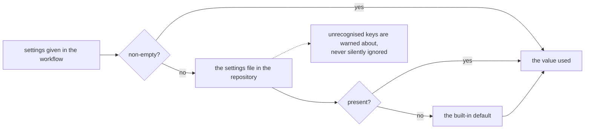

## Abstract

Everything about a run is tunable from two places — the workflow that starts it and a settings file in the repository — and this paper covers how those combine, what happens to a value nobody recognises, and the principle behind each fallback. The recurring theme is that a setting which quietly does nothing is worse than one that fails loudly, and that the safe direction to fall back in depends on what the setting controls.

## Introduction

A reviewer has a lot of knobs: which paths it looks at, how hard it thinks, how much it may say, how sure it has to be, whether it can stop a merge, and what a reviewer may do about a wrong finding. Two places make sense for setting them. Short operational values belong next to the trigger that starts the run. Long-form things — house conventions to hold the reviewer to, lists of paths — belong in a file in the repository, under review like anything else.

The hazard with two sources is silence. A value written in the wrong place, or spelled in the wrong convention, used to be indistinguishable from the feature not working — and one particular instance of that turned a merge gate off without saying anything.

## Related Work

- Parent: [Hawky](../README.md).
- Which paths are skipped and how large a batch may be shape [Assembling the Change](../assembling-the-change/README.md).
- The thinking level, output allowance, deadline, and endpoint passthrough are consumed by [Asking the Model](../asking-the-model/README.md).
- The floors and the comment cap are enforced by [Screening the Answer](../screening-the-answer/README.md).
- The threshold and the waiver switch are read by [The Merge Gate](../the-merge-gate/README.md).
- Whether the tree is searched at all is [The Reuse Check](../the-reuse-check/README.md).

## Description

**One order of precedence, everywhere.** A setting given at the trigger wins; otherwise the file in the repository; otherwise the built-in default. Values at the trigger default to empty precisely so that ordering works — an unset one falls through rather than overriding the file with a blank.

**The file is found whether or not the repository was checked out.** This is the second silence the capability had, and a worse one than a misspelled key, because nothing was misspelled: reviewing a change needs no checkout — that is the first promise the system makes — but the settings file was only ever read from one, so a workflow that took that advice had its whole file ignored without a word. It is read from the checkout when there is one and fetched from the repository over the same API that supplies the change when there is not, at the revision under review, so a change to the review policy takes effect on the proposal that makes it. Either way the run states where the settings came from, or that there were none to read.

**Unrecognised keys are reported.** Every key the file may contain is known, and anything else produces a warning. The common mistake gets its own message: a key written with hyphens where the file expects underscores is named along with the spelling that would have worked. That specific confusion is what once disabled a gate in silence.

**Fallbacks are chosen by consequence, not by symmetry.** This is the most transferable idea in this paper:

```
  an unrecognised severity threshold ──► warn, and do not gate
        a typo should not fail every change; but it must not be silent

  an unrecognised waiver mode ─────────► warn, and waive nothing
        a typo must never open a route past the gate

  an unrecognised thinking level ──────► warn, leave the endpoint's own default
        we do not know which levels this endpoint implements

  the reuse scan, the bug-report footer ► on unless switched off by name
        a typo should not quietly remove them
```

Two of those deserve their reasoning spelled out. The waiver mode degrades to the strictest setting rather than to its own default, because a mistyped value that quietly opened a route past a merge gate is worse than one that leaves the gate shut and says so. The thinking level accepts the words people reach for first — off, disabled, false — and, when the result is no thinking at all, warns about what that costs: reading a change for defects is what the thinking does, and a reviewer told not to think can finish in seconds having found nothing, which a gate cannot tell apart from a clean change.

**Defaults that cost nothing to get right.** A built-in skip list covers lockfiles, dependency and build output, minified bundles, images, snapshots, and generated sources — the files almost never worth spending tokens on. Additions are merged with it rather than replacing it, and replacing it outright is its own explicit setting.

**A derived deadline rather than a fixed one.** The wait allowed for a single request is computed from the output allowance, assuming a deliberately pessimistic generation rate and a floor and ceiling around it, so that raising the allowance also buys time to deliver it. The alternative — a fixed wait — made the standard remedy for a truncated reply guarantee a timeout instead, and it is settable directly only for an endpoint genuinely slower than the derivation assumes.

**An escape hatch for endpoints this system does not model.** Extra fields can be merged into the request verbatim, and they are applied last so an operator's value wins over anything chosen internally. It is file-only and passed through untouched, which is exactly why it is documented as a passthrough: a typo in it reaches the server.

**The shape of the settings, at a glance:**

```
  what to review     include / exclude paths, file and batch limits
  how to ask         provider, model, endpoint, thinking level,
                     output allowance, request wait, extra request fields
  what to report     severity floor, confidence floor, comment cap,
                     house guidelines, issue cap, issue labels
  what it may do     mode, gate threshold, fail on a partial review,
                     waiver mode, rehearsal
  extras             search the tree for reuse, bug-report footer
```

## Conclusion

Configuration is two sources, one precedence order, and a set of fallbacks each chosen by what going wrong in that direction would cost. The rule worth carrying elsewhere: when a value cannot be understood, decide which way to fail by asking what the setting protects — and say something either way. Start from [Hawky](../README.md) for how these settings reach each capability.
