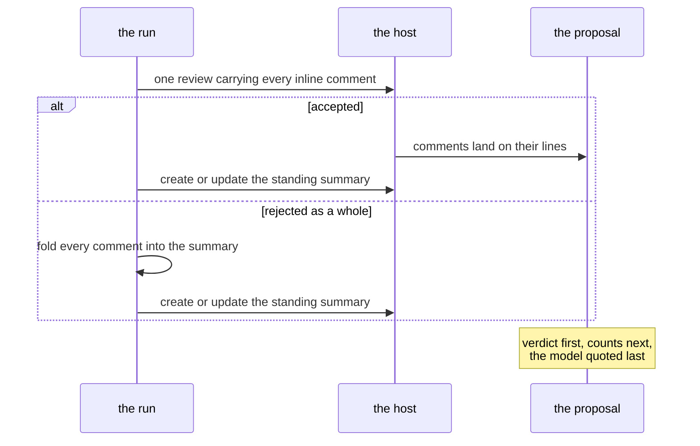
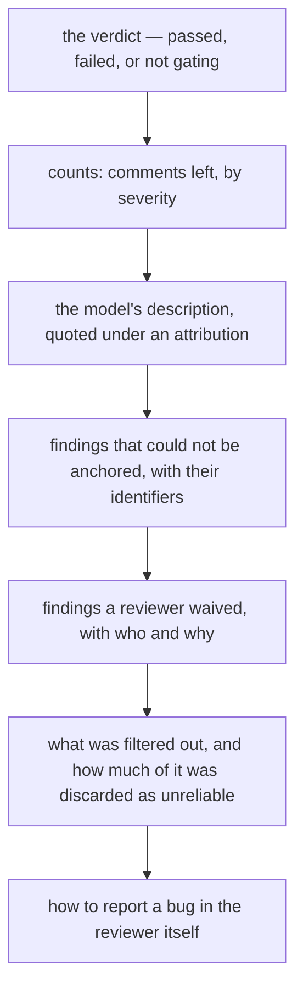

## Abstract

What survives screening has to be put somewhere a person will read it. This paper covers the two surfaces the system writes to — inline comments anchored to exact lines, and a single standing summary that is updated in place rather than piling up — along with the rule that governs both: the parts the system computed speak in its own voice, and the model's prose is quoted under an attribution.

## Introduction

A review that is hard to read is a review that gets muted. Three things make one hard to read, and each has a countermeasure here. Comments that reappear on every push train people to ignore them, so published findings carry a hidden identifier and are not repeated. A summary comment posted afresh on each run buries the conversation, so exactly one exists and is edited in place. And a wall of prose with the verdict buried in the middle leaves the most important sentence unread, so the verdict comes first.

The fourth problem is subtler and arrived from a real run: the description field carried a block of unrelated context that ended in instructions addressed to an assistant, and it was rendered at the top of a comment, above the verdict, in the system's own voice. Everything else in that comment was correct, because everything else was computed rather than generated. That is the distinction the layout now makes visible.

## Related Work

- Parent: [Hawky](../README.md).
- Only what survives [Screening the Answer](../screening-the-answer/README.md) reaches this point.
- The verdict line rendered here is decided by [The Merge Gate](../the-merge-gate/README.md).
- Structural work goes elsewhere entirely, as [Refactoring Issues](../refactoring-issues/README.md).
- The cap on comments, the rehearsal mode, and the footer switch come from [Configuration](../configuration/README.md).

## Description

**Inline comments go out as one review.** A comment carries its severity and category as a header, the reviewer's explanation, and — where the reviewer offered a complete replacement for the lines it anchored to — a block the reader can apply in one click. A hidden marker at the end carries the finding's identity; it is invisible in the rendered comment and is how the next run knows this finding has already been said.

```
┌──────────────────────────────────────────────────────────┐
│ **Medium · over-engineering** — reuse: second impl. of …  │  ← severity, category, one line
│                                                          │
│ what to cut, what replaces it, and what it saves.        │  ← two to five sentences
│                                                          │
│ ┌ suggestion ───────────────────────────────┐            │  ← applied in one click
│ │ the replacement for the anchored lines     │            │
│ └────────────────────────────────────────────┘            │
│ <!-- hidden identity marker -->                          │  ← how the next run recognises it
└──────────────────────────────────────────────────────────┘
```

A multi-line anchor is accepted only when every line in its span is part of the change, which also keeps it inside a single fragment; a span far longer than a handful of lines is almost always a mis-anchor and is narrowed to its first line.

**When the host rejects the review as a whole**, which one bad anchor is enough to cause, the comments are not lost: every one of them is folded into the summary instead, and the run says in the log why they are not inline. Those have no thread to reply in, so the summary prints each one's identifier — the only handle a reviewer has for waiving one.

**The standing summary is the run's own report.** Exactly one exists per proposal: it is found by its marker and edited, or created if absent. Its order is the argument of this paper made concrete.



The verdict line is written where the reviewer already is, rather than only in the run's outputs, because a gate that was never switched on otherwise looks exactly like a gate that was switched on and found nothing. It distinguishes three states that used to blur together: nothing found, nothing above the reporting bar with a count of what was filtered, and a highest severity that did clear it. When a check is green only because somebody waived something, the verdict says so.

**Two voices, visibly separated.** The verdict and the counts are assembled from values the run computed and read as the system's own words. The description is quoted under an explicit attribution naming the provider and model that wrote it — every line of it prefixed, blank lines included, so the whole block stays inside the quotation instead of ending it partway down. Quoting does not make the content safe; nothing can. It makes the provenance legible, which is the part the system can actually be responsible for. And when a description was withheld, the summary says so and why, rather than passing over it in silence and leaving a reader to wonder.

**The footer is written to two audiences.** A collapsed section explains how to report a bug in the reviewer itself, with the version, provider, model, and settings already filled in — and it distinguishes that from disagreeing with a finding, which has its own route. Because coding agents read these comments too, it addresses them directly: check with your user before filing, look for an existing report first, and leave the reviewed repository out of it — no code, paths, comment text, or names, since the reviewer's own tracker is public and the repository under review may not be. It is written in plain sight rather than hidden, on the principle that an agent is right to distrust instructions it cannot show the person it works for.

**Rehearsal.** A run can be asked to log everything it would publish — the full summary and every inline comment — and write nothing. In that mode it also skips reading the existing conversation, since there is nothing to deduplicate against.

## Conclusion

Publishing is where the system's warranty becomes visible: computed facts first and in its own voice, generated prose last and in quotation marks, one standing summary instead of a pile, and hidden identifiers so nothing is said twice. The fallback path — every comment folded into the summary when the host refuses the review — is what keeps a single bad anchor from costing the whole review. For the verdict line this page renders, see [The Merge Gate](../the-merge-gate/README.md).
