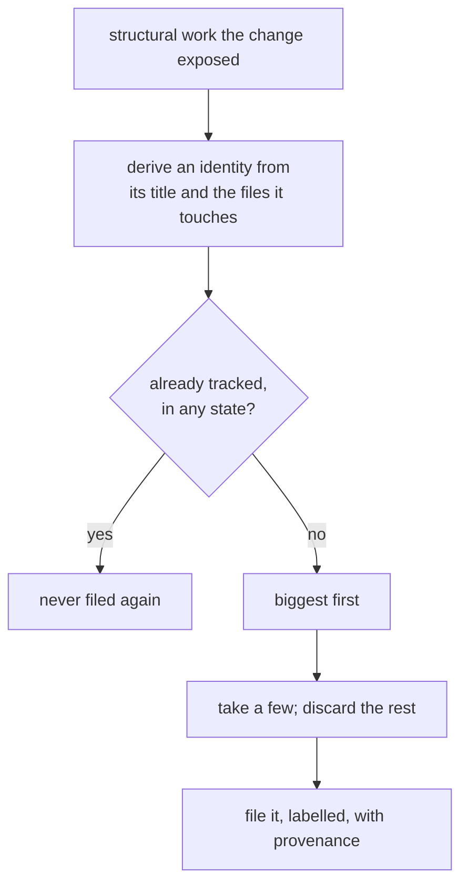

## Abstract

Some of what a review notices is too large to be a comment on a line: duplicated logic across modules, a component that has outgrown its responsibility, a pattern being copied for the third time. Those are reported separately and filed as tracked issues. This paper covers what qualifies, how an issue is recognised across runs so it is never filed twice, and why a closed one stays closed.

## Introduction

An inline comment is the wrong container for work that spans files and takes days. It attaches to one line, it disappears when the change merges, and it asks for a decision from whoever happens to be reading a change rather than from whoever plans the work.

Filing issues instead brings its own failure mode, and it is the one this capability is mostly shaped by: a reviewer that files structural suggestions on every proposed change will bury a tracker in weeks. Three mechanisms hold that back — this is a separate mode rather than something that happens alongside every review, only a few issues may be filed per run, and an issue that already exists is never filed again.

## Related Work

- Parent: [Hawky](../README.md).
- The reviewer is asked for these, and told how few to send, in [Asking the Model](../asking-the-model/README.md).
- Inline findings take a different route entirely, in [Publishing the Review](../publishing-the-review/README.md).
- Whether this runs, how many issues it may file, and what they are labelled come from [Configuration](../configuration/README.md).

## Description

**It is a mode, not a side effect.** A run can leave comments, file issues, or do both. The pairing most teams want is comments on proposed changes and structural issues on the main line after they merge — the same reviewer, triggered at two different moments, because that is where each kind of output is actually useful.

**What the reviewer is asked for** is the small set of things that earn a separate piece of work: duplication worth removing, a responsibility that has outgrown its home, an abstraction that is leaking. It is told how many will actually be filed, so it does not spend output on ones that will be discarded unread — and told to prefer the work that ends with less code than it started with, because a refactor that deletes a layer beats one that adds a better layer. Each comes back with a one-sentence rationale, the paths it would touch, a rough effort estimate, and a proposal body.

**Identity across runs** is derived from the normalised title and the sorted set of files the work would touch. That identity is carried in a hidden marker in the issue body, and every issue the system has ever filed under its labels is read back — **in any state** — before anything new is filed.

```
  the tracker, read back under our labels
        ├── open issues ────► already tracked, skip
        └── closed issues ──► still tracked, skip
```

The closed half is the part worth stating plainly. A maintainer closing a suggestion is a decision, and re-filing it on the next run would be obnoxious. So a closed issue is never reopened and never filed again.

**Ordering and the cap.** What is left after deduplication is sorted with the largest efforts first and truncated to the configured few, so that the cap keeps the work worth having rather than whatever happened to be listed first. Duplicates within a single run are collapsed too.

**Filing.** Labels are created if they do not exist yet, and a failure to create one — losing a race with a concurrent run, or lacking permission to manage labels — is noted quietly rather than failing the run. Each issue body carries the rationale, the proposal, the paths in scope, the effort estimate, and, when the work was noticed while reviewing a specific proposal, a line saying which one and at which revision. It ends by saying that closing it is a decision the system will respect.

```
┌─ issue ─────────────────────────────────────────────┐
│ title:  imperative and specific                     │
│ ─────────────────────────────────────────────────── │
│ one sentence on why this is worth doing now         │
│ ## Proposal — current shape, problem, steps         │
│ ## Scope — the paths the work would touch           │
│ estimated effort                                    │
│ surfaced while reviewing <which change>             │
│ <hidden identity marker>                            │
└─────────────────────────────────────────────────────┘
```

A failure to file one issue is logged and the rest proceed; rehearsal mode logs the full body of each without writing anything.

## Conclusion

Structural work is filed rather than commented, kept rare by being a separate mode with a small cap, and kept respectful by an identity that survives across runs and treats a closed issue as a decision. The reviewer's instructions for producing these — including the preference for refactors that remove a layer rather than add one — are in [Asking the Model](../asking-the-model/README.md).
