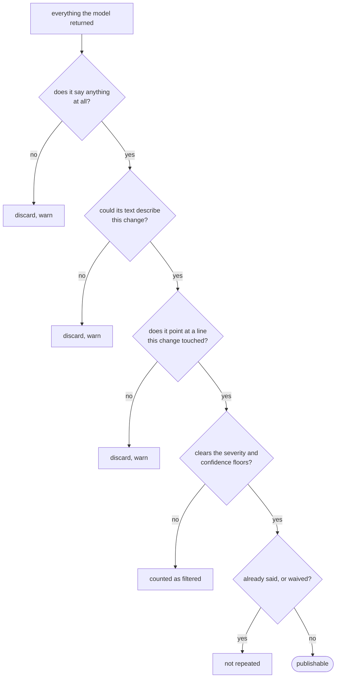
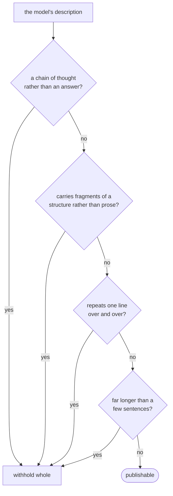

## Abstract

This is the trust boundary. Everything the model returns is treated as a claim rather than a result, and this paper describes the checks each claim has to survive before it can become a comment, count towards a verdict, or appear in a summary. None of them read the text for meaning. They test properties that hold of any honest review of any change — it says something, its words touch the file it points at, its line exists in the change — plus the ordinary quality floors a maintainer sets.

## Introduction

Two things make screening necessary rather than fastidious. The first is that a reviewer reading fragments will occasionally describe code it was never shown: a line number just outside the change, a symbol from somewhere else, a claim about a file it has confused with another. The second is that free-form prose comes apart in characteristic ways — a reply that is all deliberation and no answer, a block of unrelated context pasted in, one clause repeated eleven times, a fragment of structure spliced into a sentence.

Both matter more when a review can block a merge. A finding that cannot be true of any change still turns a required check red, and neither remedy applies to it: there is no code to fix, and waiving it means stating that a specific claim was considered, which cannot honestly be written about a claim that says nothing.

The design rule throughout is therefore: **check shape, not meaning**. Judging whether a review is *correct* needs another reviewer. Judging whether it is *a review at all* needs only properties the system can test against things it already holds — the change, the file, and its own counts.

## Related Work

- Parent: [Hawky](../README.md).
- The addressable-line record every anchor is checked against comes from [Assembling the Change](../assembling-the-change/README.md).
- What survives here is rendered by [Publishing the Review](../publishing-the-review/README.md) and read by [The Merge Gate](../the-merge-gate/README.md).
- The floors, the cap on comments, and the waiver switch are set in [Configuration](../configuration/README.md).

## Description

**Findings run a funnel**, and the order is deliberate: the disqualifying checks run before the ones about quality, so that a finding which makes no claim is never weighed on severity or reported as filtered.

```
 returned by the model
   │
   ├─ says nothing ──────────────────► discarded, warned individually
   ├─ text cannot describe the file ─► discarded, warned individually
   ├─ complexity finding rated high ─► capped to the middle of the scale
   ├─ below the severity floor ──────► counted as filtered
   ├─ below the confidence floor ────► counted as filtered
   ├─ waived by a reviewer ──────────► reported separately, never re-posted
   ├─ line is not in the change ─────► discarded, warned individually
   ├─ already commented on ──────────► not repeated
   └─ past the cap on comments ──────► counted as filtered
```

**A finding with no text** passes every type check and renders as its own header and nothing else. It is dropped, and dropped early: it cannot be read, cannot be acted on, and cannot honestly be waived. There is a second reason to insist on a title — identity is derived from it, so every textless finding in one file would collapse to a single identifier, which is what both repeat-suppression and waivers read.

**A finding whose text cannot describe any change** is the subtler case, and it comes from a real incident: on a change of one line, a finding asserted at middle severity that an identifier occurring nowhere in the repository was a duplicate of itself, and turned a required check red. Two rules catch that class without reading for meaning. A title that asserts one thing is a restatement of *the same* thing is unfalsifiable — there is no pair for the relation to hold between. And a title that names code explicitly, none of which appears anywhere in the file it points at, is not about that file. Only the title is screened, because a body legitimately names things outside the change: the replacement it proposes, a library call to use instead.

**An anchor outside the change** is the strongest available evidence that the reviewer misread its partial view and invented a location. Such a finding leaves the run entirely rather than being demoted: published, it is a review discussing code that is not there; counted, it fails a merge over a hallucination. It is judged as a property of the finding rather than at the moment of posting, because whether it describes a changed line does not depend on whether this particular run happened to be publishing it.

**Complexity findings are capped in severity in code**, not only in the brief. Severity is the model's own field and it is what the gate reads; left uncapped, one enthusiastic rating on a hand-rolled helper fails a change with no defect in it.

**Identity across runs** is what stops the same comment arriving on every push. A finding's identity is derived from its path, its category, and its normalised title — deliberately *not* its line number, so a finding that scrolls down when the file above it is edited is recognised as the same finding. The identifier is carried in a hidden marker on each published comment, which is also how waivers and repeat-suppression find it later.

**Prose is screened separately**, because the description of the change is the one field that is free model writing rather than something the system assembled. Four shape checks, in order of how much they say about the run:



Withheld *whole*, never truncated: in the run that prompted these checks the foreign block sat at the front, so keeping the opening would keep precisely the part that must not be published — and a later run put its damage at the end, so there is no end to trust either.

There is one check that does read what a description says, and it is deliberately narrow. When the run produced no findings at all, a description asserting that it found one, or that one was waived, is withheld too — otherwise a single comment states both that nothing was found and that something was, a few lines apart, with nothing in it to tell a reader which to believe. It runs only on an empty run, it leaves negated sentences alone so that saying nothing was found stays sayable, and it withholds one field rather than failing anything, because it will eventually be wrong: a change to this system's own gate is reviewed in exactly the vocabulary these patterns look for.

**Nothing rejected is quoted back.** A reason can reach the same published comment, and echoing a fragment of something withheld for being instruction-shaped publishes a smaller copy of it. Reasons are assembled from the rule that fired and from counts.

**Screening happens twice for prose** — once per batch, so one bad batch does not cost the run the descriptions the others wrote, and once across the run, because a claim about the review can only be checked after every batch has reported.

## Conclusion

Screening is where this system's character sits: generous with the endpoint, suspicious of the answer. Every check tests a property that holds regardless of what the review says, every discard is named in the log and counted where a reader can see it, and the disposition is always to withhold one item with a reason rather than to fail the run. What survives goes two places — [Publishing the Review](../publishing-the-review/README.md) and [The Merge Gate](../the-merge-gate/README.md).
