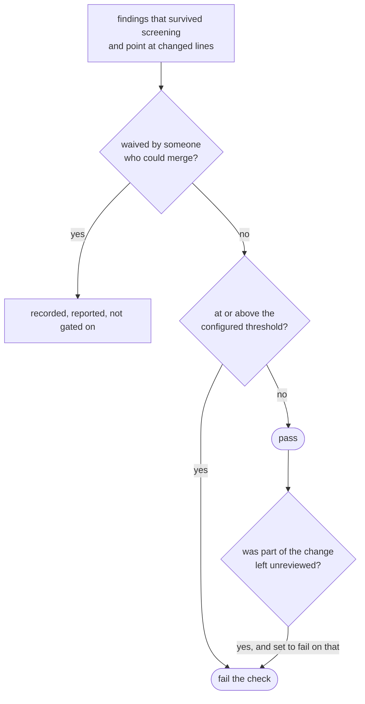
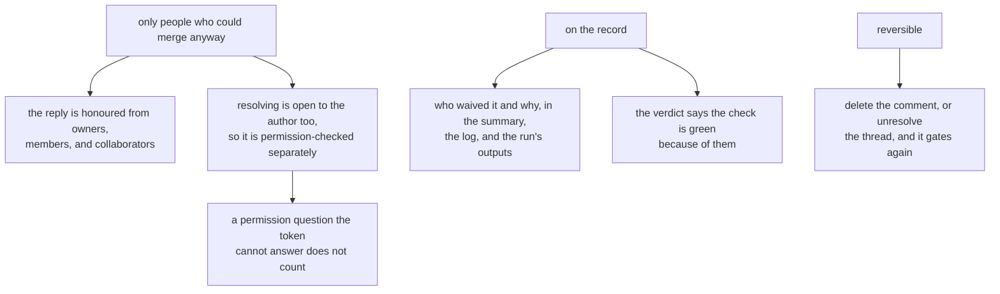

## Abstract

A review becomes a merge gate when the run is allowed to fail on what it found. This paper covers what the gate reads, why it is off until someone turns it on, how the decision is made visible in three places at once, and the escape hatch without which a wrong finding is a deadlock: a maintainer's waiver, which is permission-checked, recorded, and reversible.

## Introduction

Gating changes the stakes of everything upstream. Up to this point a wrong finding costs a reader thirty seconds; past it, a wrong finding stops work. Two consequences follow.

The first is that the gate must read only findings the system has reason to stand behind — which is why the disqualifying checks exist, and why a finding pointing outside the change never reaches this page at all.

The second is that there has to be a way past a wrong one. The gate re-reads every finding on every push, so pushing more commits does not clear one. Without a waiver, the only way to turn a check green is to change code a reviewer has already decided is correct — the wrong fix, arrived at under deadline pressure, which is worse than no gate at all.

## Related Work

- Parent: [Hawky](../README.md).
- What the gate reads is whatever survived [Screening the Answer](../screening-the-answer/README.md).
- The verdict decided here is rendered on the proposal by [Publishing the Review](../publishing-the-review/README.md).
- A partly-reviewed change becomes possible when batches fail in [Asking the Model](../asking-the-model/README.md).
- The threshold, the waiver switch, and the partial-review setting are all set in [Configuration](../configuration/README.md).

## Description

**What the gate reads.** Every finding that cleared the severity and confidence floors and anchors to a line the change actually touched — including ones an earlier run already commented on, and excluding ones a reviewer has waived. Repeats count, because an unresolved serious finding is still serious on the second push, and whether a comment happened to be new is a fact about the conversation rather than about the code.

**It is off until someone turns it on.** With no threshold set, the reviewer leaves its most serious comments and the check still passes. That default is deliberate but it used to be invisible, so the state is now said out loud in three places: the run log, the run's own report, and the standing summary on the proposal. If a serious comment is sitting on a green check, that line is the first thing to read.

**A partly-reviewed change cannot honestly report a pass.** When some batches failed outright and the run is configured to care, the check fails with a message saying so — a green check on a change that was only half read is worse than a red one. When every batch fails, the run fails regardless.

**Waivers.** A maintainer says, in the thread of a finding, that it is wrong. Two gestures can mean that, and which of them count is a setting:

```
  a reply naming the reviewer and asking it to ignore ──► always counts
  resolving the review thread ─────────────────────────► counts unless narrowed
  nothing ─────────────────────────────────────────────► the gate is absolute
```

A finding that never got a thread — one folded into the summary because the host refused the review — is waived by naming its printed identifier in a comment on the proposal instead.

Three properties keep this from being a hole in the gate:



The permission check degrades closed: a token that cannot answer whether someone can merge does not get to waive the gate, and it says so once rather than quietly weakening the check. The system's own comments are skipped when looking for the command, because they explain the command and therefore contain it.

A waived finding leaves the run entirely — it does not gate, and it is not re-posted either, so re-reviewing does not resurrect a settled argument.

**The check does not go green on its own.** A required check belongs to a commit, and a comment does not produce a new one, so after waiving, the job is re-run. That is the same number of clicks as an administrative override and, unlike an override, it leaves a record.

**The verdict is written before anything that can throw**, so a downstream job reading it gets a definite answer even when the run dies early, and the run's outputs are written even on a failing run so they can be read alongside one.

**And the gate says why it decided what it did**, in the log, every time — including when it is off. "Why did this pass?" has to be answerable from the run alone, without re-reading the workflow that started it.

## Conclusion

The gate is a threshold applied to findings the system is prepared to stand behind, off by default, stated everywhere it applies, and escapable only by people who could merge anyway — on the record, and reversibly. Its design assumption is that the reviewer will eventually be wrong, and that what matters is whether being wrong costs a waiver and a re-run or costs a team its trust in the check. See [Screening the Answer](../screening-the-answer/README.md) for what never reaches the gate in the first place.
