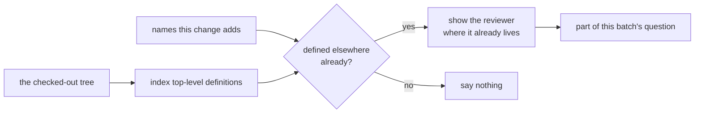
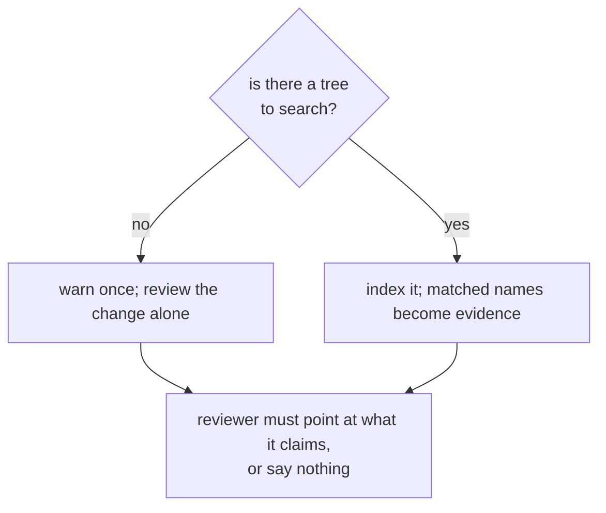

## Abstract

One of the two questions the reviewer is asked — could this change simply not have written this? — has a half that no reader of fragments can answer: is it already in this repository? This paper describes how that half is answered before the model is called, by indexing the definitions in the checked-out tree, matching them against the names the change adds, and putting the matches into the question as evidence. It is retrieval rather than a tool loop, so the review is still a single request per batch.

## Introduction

A reviewer shown only the changed fragments has no way to know what the rest of the repository already defines. Asked anyway, it does what anyone would: it speculates, at length. Runs before this existed spent almost all of their output allowance deliberating on a question they had been handed no way to settle.

There are two ways out. One is to let the model go looking — a second generation, tool calls, a loop. The other is to answer the question first and hand over the answer. The second is taken here, because speculation is what is expensive: facts are cheap to think about, and the review stays one request per batch.

The reader needs one boundary up front. This finds a name that is defined twice. It does not find twenty lines quietly re-implementing an existing helper under a different name; that needs structural or semantic similarity and is a much larger piece of work. This is the cheap half, and it is worth having on its own.

## Related Work

- Parent: [Hawky](../README.md).
- The evidence gathered here is written into the question by [Asking the Model](../asking-the-model/README.md), which also carries the rules for what may be reported from it.
- The batches whose added names are looked up come from [Assembling the Change](../assembling-the-change/README.md).
- Findings produced from this evidence are capped in severity, and filtered like any other, by [Screening the Answer](../screening-the-answer/README.md).
- Whether the scan runs at all, and which paths it skips, come from [Configuration](../configuration/README.md).

## Description

**Only top-level definitions are indexed**, and that is a judgement rather than a shortcut. An indented definition is a local; a method named the same on two unrelated types is not a re-implementation of anything. Matching either produces evidence for something nobody duplicated, which costs question space and invites the reviewer to adjudicate noise. Missing a helper defined inside something else is the cheaper mistake.

**Names are compared across house styles.** Two spellings of the same helper — one in snake case, one in camel case — are the same helper, and a polyglot repository is exactly where that duplication happens. Very short names are ignored: two files both using a two-letter name share it by accident, not by duplication.

```
  a name this change adds
        │
        ├── normalise away separators and case
        ▼
  look it up in the indexed tree
        │
        ├── found only at the path that added it ──► that is the change itself, not a prior
        ├── found nowhere else ────────────────────► nothing to say
        └── found elsewhere ───────────────────────► evidence: the name, where it lives, its definition line
```

The middle branch matters more than it looks. The checkout is the finished revision, so every name the change adds is also in the index at the path that added it; without discarding its own path, every new definition would be reported as a duplicate of itself.

**The scan is bounded in every direction it can run away in.** Directories the skip list would exclude are pruned whole rather than walked and filtered file by file, so a dependency folder cannot consume the entire file budget. Oversized files are passed over as generated or vendored. A ceiling on files scanned keeps an enormous repository from stalling a run. Anything unreadable is skipped rather than fatal — an unreadable directory is not worth failing a review over.

**What reaches the question is capped twice**, by count and by characters, whichever comes first. The evidence exists to inform the change being reviewed and must not crowd it out. The reviewer is also told, in the same breath, that two things sharing a name are not necessarily the same thing, and to read the definition before reporting it.

**Without a checkout there is nothing to search.** A workflow that never copies the repository is a supported way to run — it is the lightest possible setup and the first promise the project makes — so the absence of a tree is not an error. The scan is skipped, a single warning says so and how to enable it, and the review proceeds exactly as it otherwise would. In that mode the reviewer is still asked the reuse question but told to point at the code it claims already exists, and to drop the finding when it cannot.



## Conclusion

The reuse check replaces a question the reviewer cannot answer with facts it can read, at the cost of one filesystem scan per run and no extra model calls. Its reach is deliberately narrow — a name defined twice, across spelling conventions, at the top level — and everything about the scan is bounded so that a large repository degrades into a slightly less informed review rather than a stalled one. For how the evidence is worded into the question, and the rules constraining what may be reported from it, see [Asking the Model](../asking-the-model/README.md).
